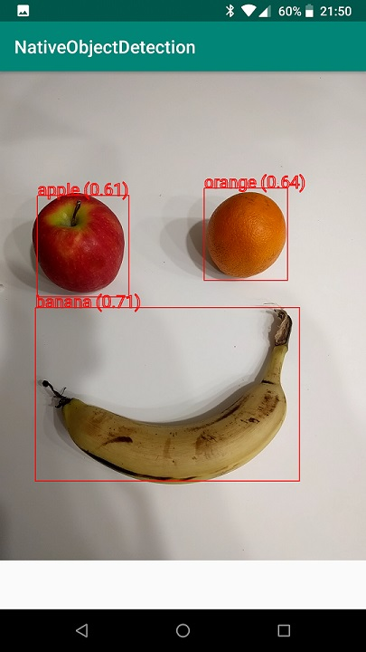

# Cross-Platform TFLite Object Detection

This is a sample application of running object detection using TensorFlow Lite in c++

It is part of [this](https://www.thecodingnotebook.com/2019/11/cross-platform-object-detection-with.html) blog post series.

This repo contains sample application in Android and iOS.

# Setup

## TensorFlow Lite libraries
This project is dependent on TensorFlow Lite lib and headers, you can
either build them yourself (as explained) in the blog post above, or by
running `download-tf-dist.sh` which downloads prebuilt libraries from
[this repo](https://github.com/ValYouW/tflite-dist/releases) of mine.

In any case, the project expect to have a folder structure like so:

Headers:

`tflite-dist/include/flatbuffers` - Flatbuffers headers
`tflite-dist/include/tensorflow/lite` - tflite headers

TensorFlow Lite shared object library:

`tflite-dist/libs/andoird/arm64-v8a/libtensorflowlite.so`
`tflite-dist/libs/andoird/armeabi-v7a/libtensorflowlite.so`
`tflite-dist/libs/andoird/x86/libtensorflowlite.so`
`tflite-dist/libs/andoird/x86_64/libtensorflowlite.so`
`tflite-dist/libs/ios/libtensorflow-lite.a`

## OpenCV
This project makes use of OpenCV (tested against version 4.0.1)

### OpenCV for Android

* Download OpenCV Android SDK from [here](https://opencv.org/releases/)
* Extract the zip file.
* Define global environment variable `OPENCV_ANDROID` pointing to the
root folder of the opencv android sdk (by "global environment variable"
the meaning is that it will be available for Android Studio).
* This environment variable is used by `app/CMakeLists.txt` as follow:
`set(OpenCV_DIR $ENV{OPENCV_ANDROID}/sdk/native/jni)` so double check
it points to the correct location

For a complete guide see [this blog post](https://www.thecodingnotebook.com/2020/04/image-processing-with-opencv-in-android.html)

### OpenCV for iOS
Managed as a pod, just `pod install`

# Object Detection Model
Note that this repo contains a tflite object detection
model (SSD MobileNET V1 published by Google, [link to original](http://storage.googleapis.com/download.tensorflow.org/models/tflite/coco_ssd_mobilenet_v1_1.0_quant_2018_06_29.zip))
so make sure the folder `tflite-models` is available as it is being
referenced as an embedded resource by both apps.

# Sample output

## License
MIT
